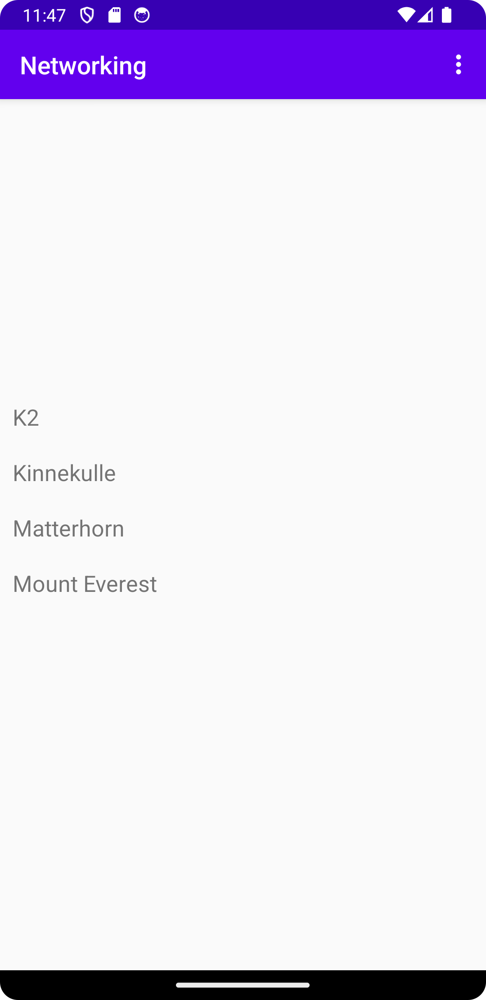

# Rapport

Skapade en Mountain class som korrelerar med mountains.json och la till elementet RecyclerView i "activity_main.xml".

Skapade en RecyclerViewItem class samt definiera layouten för den i layout filen "recyclerview_item.xml"
sedan skapades det en RecyclerViewAdapter class som en subclass av  RecyclerView.Adapter <RecyclerViewAdapter.ViewHolder>
för att kunna uppdatera och visa innehållet i RecyclerView. 

Definierade så att en item (RecyclerViewItem) i RecyclerView motsvarade en Mountain object.
Möjliggjorde att RecyclerView visade items från filen "mountains.json".

Därefter la jag till en meny med alternativet "Update" för att kunna
uppdatera RecyclerView.

Sedan byttes url på JSON_URL till FamousPeaksJSON url i filen "MainActivity" för att hämta den nya json datan som ska visas i RecyclerView.
Efter åt implementerades det kod i onPostExecute() som ska uppdatera innehållet i RecyclerView. 


Kod på parsing av Json array "mountains.json" till ArrayList<Mountain> mountains:
```
 new JsonFile(this, this).execute(JSON_FILE);
 String s = readFile("mountains.json");
 Gson gson = new Gson();
 Type type = new TypeToken<List<Mountain>>() {}.getType();
 mountains = gson.fromJson(s, type);
```



